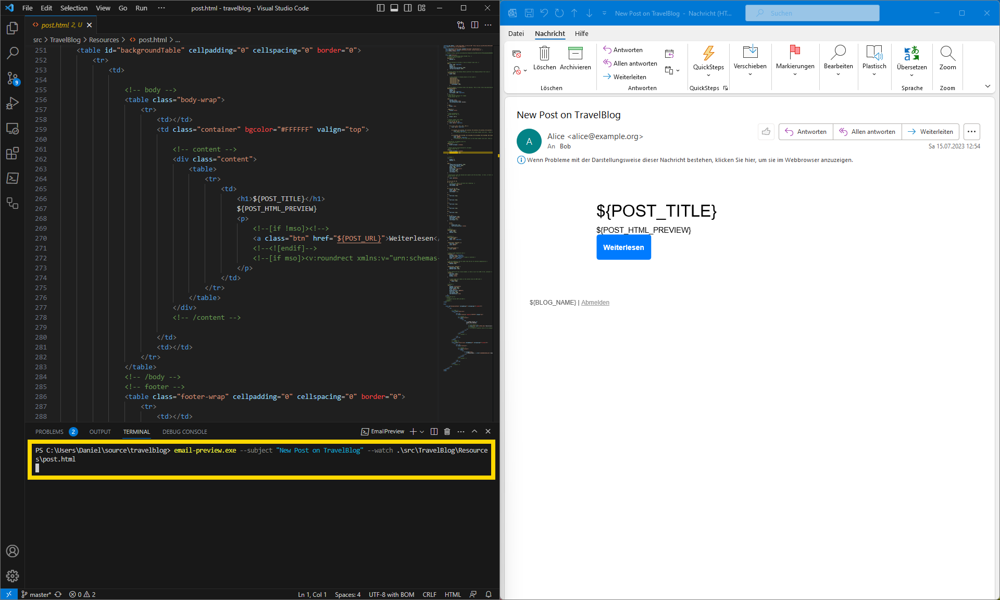

# Email Preview

> ⚠️ This project has been discontinued. I recommend to use [MJML](https://mjml.io/) for email templates instead of pure HTML. MJML renders almost perfectly consistent across different email clients and there is a preview available for VS Code as an [extension](https://marketplace.visualstudio.com/items?itemName=mjmlio.vscode-mjml).

Email preview lets you preview your HTML email templates in Microsoft Outlook with hot reload.

## Contribute

Contributions are highly welcome. Please open an issue before implementing a feature to discuss your plans.

Email Preview is a very simple C# application, but I took the chance to test some brand new packaging technologies.
For blazing fast startup, Email Preview uses native AOT compilation and for easy installation it is packaged as Appx for Microsoft Store.

Prerequisites:
- Microsoft Visual Studio 2022
- .NET 7.0 SDK
- MSVC C++ x64/x86 build tools
- MSVC C++ ARM64/ARM64EC build tools
- Windows 11 SDK (10.0.22000.0)
- Tools for Universal Windows Platform
